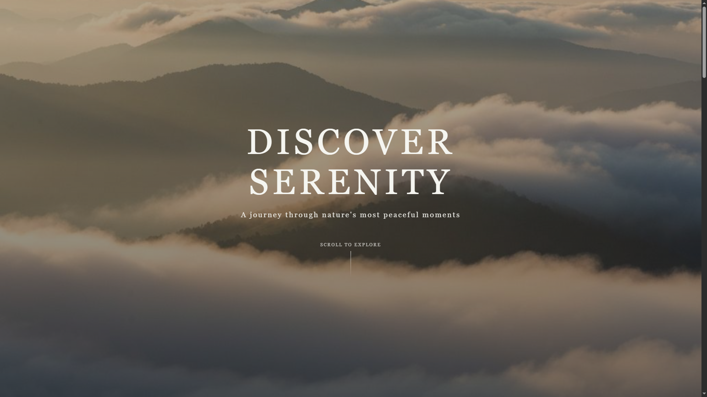
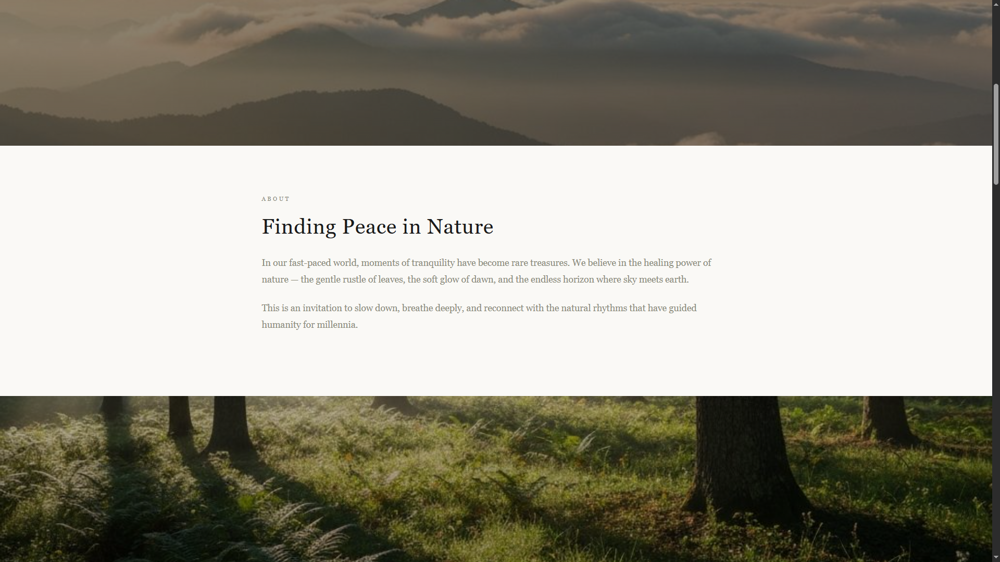
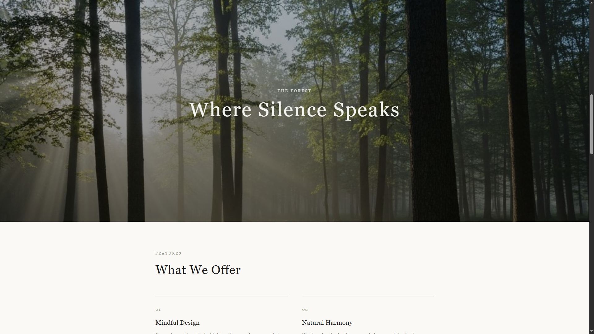
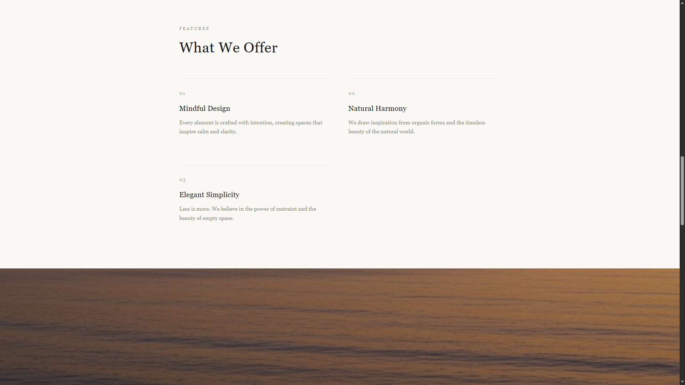
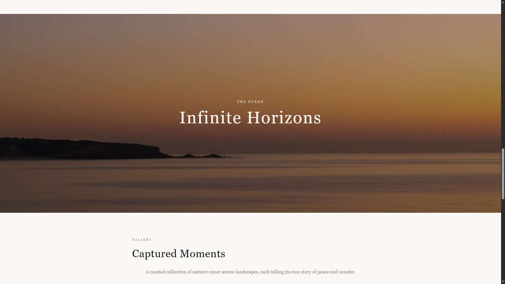
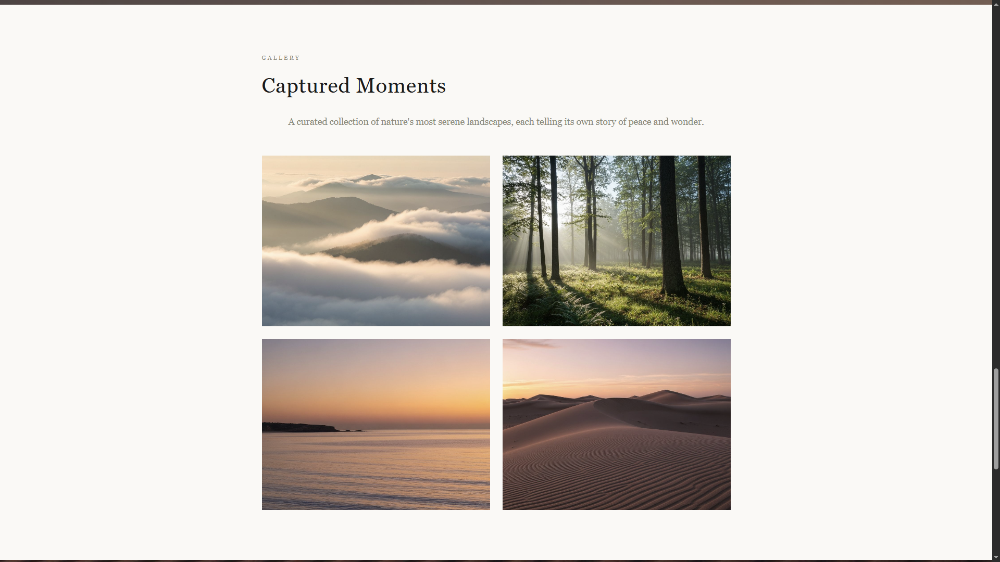
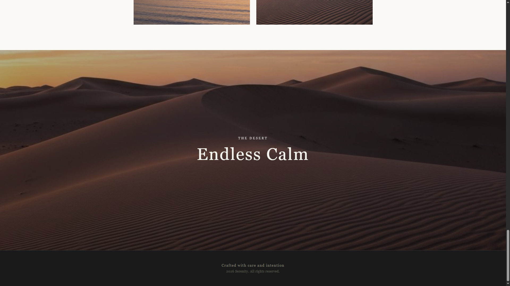
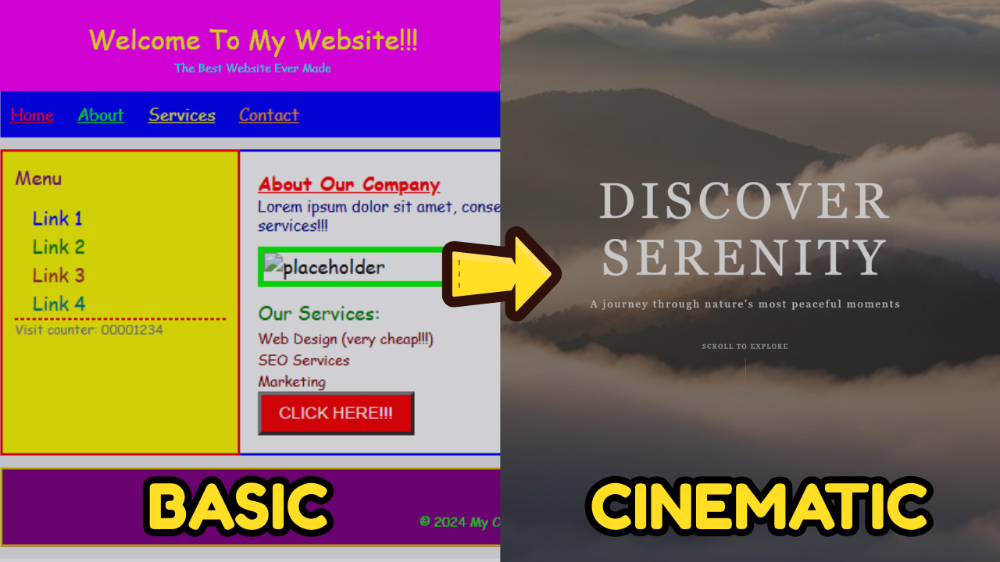

# 🌿 Serenity Parallax

A calm, nature-inspired parallax landing page built with plain HTML and CSS. It layers immersive background imagery, soft typography, and spacious sections to create a cinematic scrolling experience without adding any framework overhead.

## Preview

### 1. Hero



### 2. About



### 3. Forest Parallax



### 4. Features



### 5. Ocean Parallax



### 6. Gallery



### 7. Desert Parallax



## Tech used

- HTML
- CSS

## Project structure

```text
serenity-parallax/
├── assets/
│   ├── images/
│   └── readme/
├── index.html
└── index.css
```

## Run locally

This is a static project, so you can open `index.html` directly in your browser.

If you prefer using VS Code Live Server or a similar local server, that works too.

## 🎥 Tutorial video

There is also a companion tutorial video for this project, where the parallax effect and layout are built step by step.



If you want to see how it was made, watch it here: [Serenity Parallax tutorial video](https://youtu.be/Mn675-ER7Lg).
